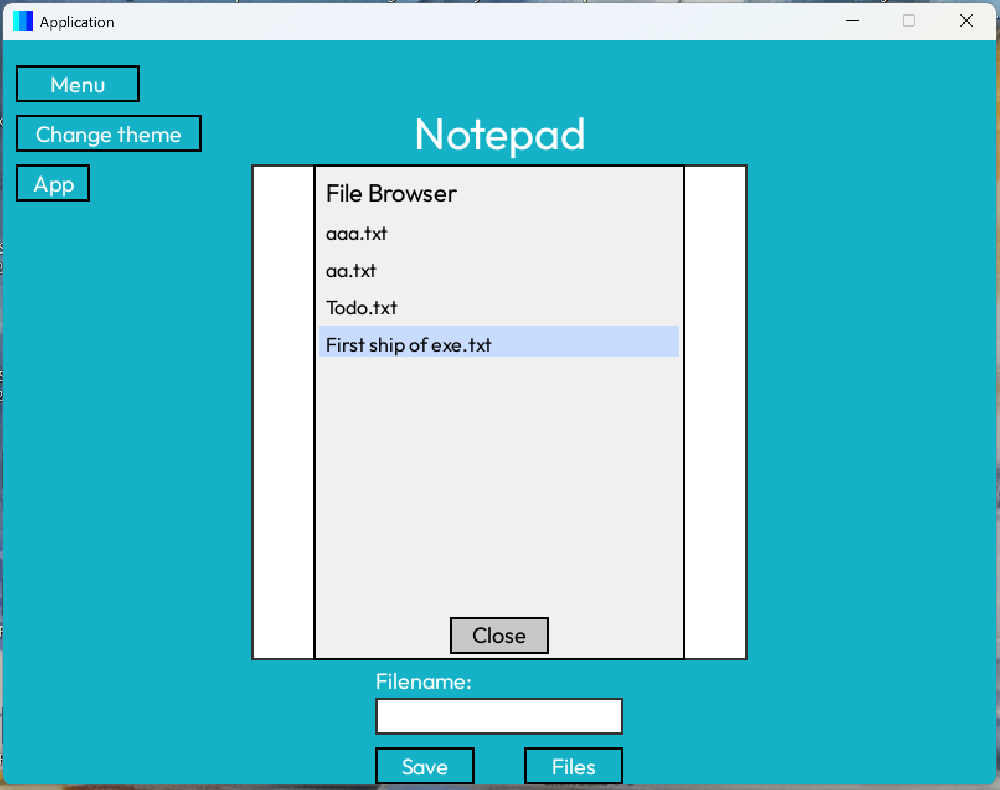
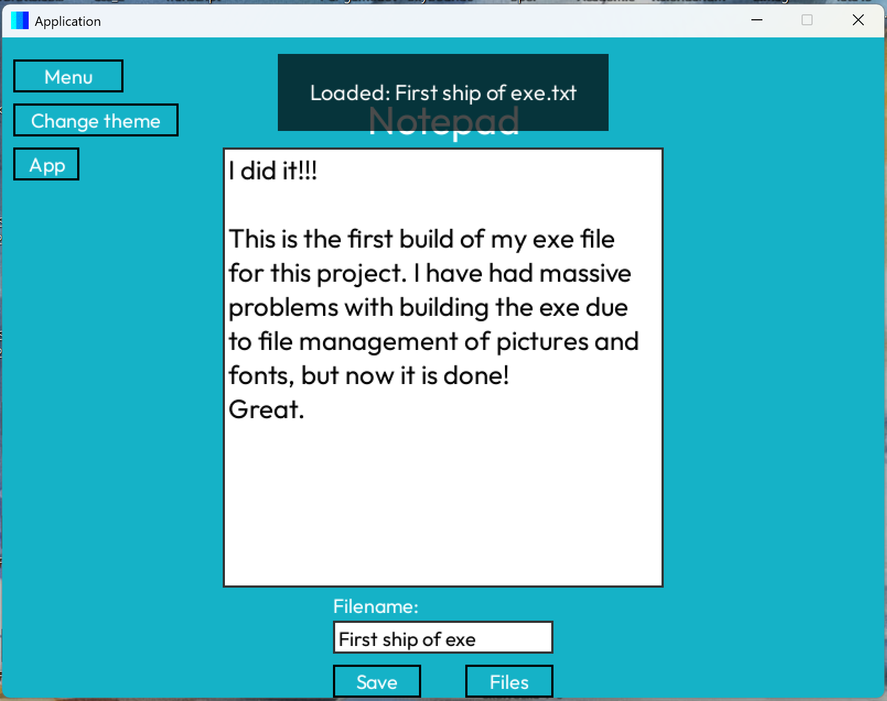
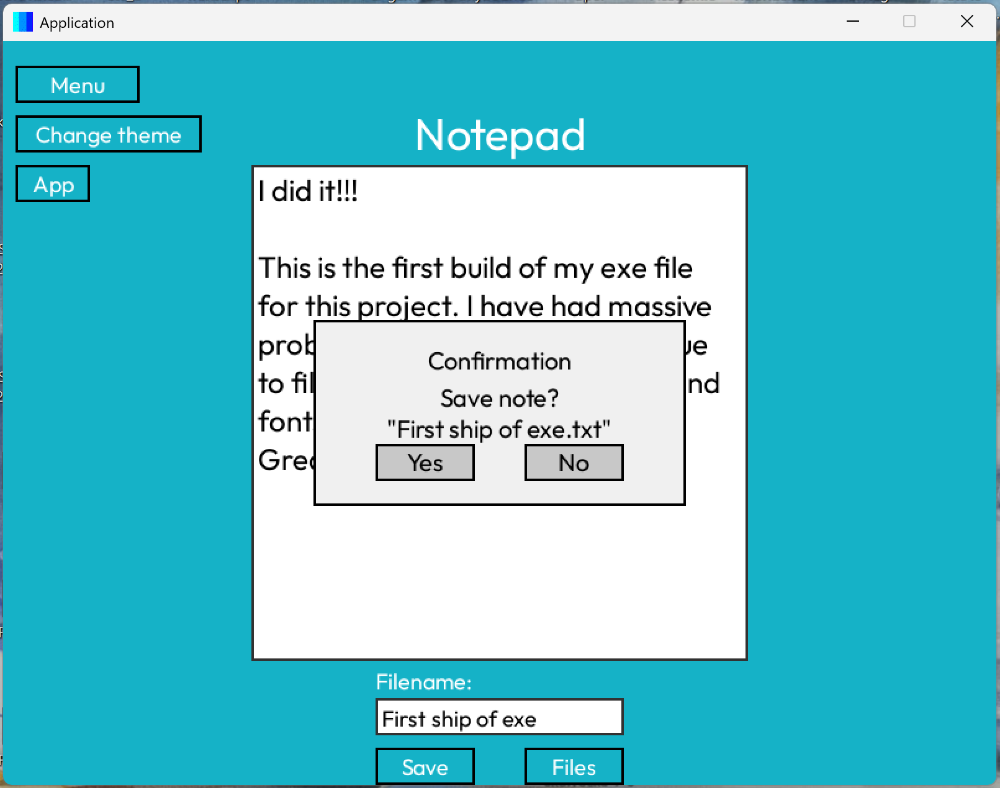

# Pygame Notepad Application

This directory is an application for a notepad
It features
- Operative system agnostic - works on Windows, Mac, Linux
- Ability to write notes, save notes and load notes
- Confirmation dialog and in app file browswer
- interactive text boxes which allow for writing when clicked
- Beautiful interactive frontend with UI, animations and popups
- Backend with state management for handling different screens
- Ability to switch between light mode and dark mode
- Easy, OS-agnostic, one line build with a .spec file
- Only 29.5 MB





## Usage

- The app allows the user to write down notes, save them and load earlier notes
for writing down everyday things like ToDo lists, thoughts, etc, in a pleasant
UI.
- The modularity of the repository allows for more apps to be built, based of the
features in the repo.

## Project Structure

```
Notepad-app
├── src
│   ├── main.py                # Entry point of the application
│   ├── states                 # Contains different game states
│   │   ├── __init__.py
│   │   ├── base_state.py      # Abstract base class for other states
│   │   ├── menu_state.py      # Menu state with buttons to traverse to other states
│   │   ├── app_state.py       # App state with buttons to traverse to apps
│   │   └── write_state.py     # Notepad state to write, save and load notes
│   ├── components             # Contains reusable components
│   │   ├── __init__.py
│   │   ├── button.py          # Button class with actions and hover effects
│   │   └── text.py            # Text class for rendering text
│   ├── assets                 # Contains assets like fonts
│   │   ├── fonts
│   │   │   └── Outfit.ttf     # Font file for rendering text
│   │   └── imgs
│   │       └── icon.png       # Icon for the application
│   └── README.MD              # Current things Im working on, on the project
├── requirements.txt           # Lists project dependencies
└── README.md                  # Project documentation
```

## Setup Instructions

1. Clone the repository:
   ```
   git clone https://github.com/AxelSuu/Notepad-App
   cd Notepad-App
   ```

2. Install the required dependencies:
   ```
   pip install -r requirements.txt
   ```

3. Build the application
   ```
   pyinstaller pygame_app.spec
   ```
4. Or run the application
   ```
   python3 main.py
   ```

## Contributing

Feel free to submit issues or pull requests for improvements or bug fixes.
